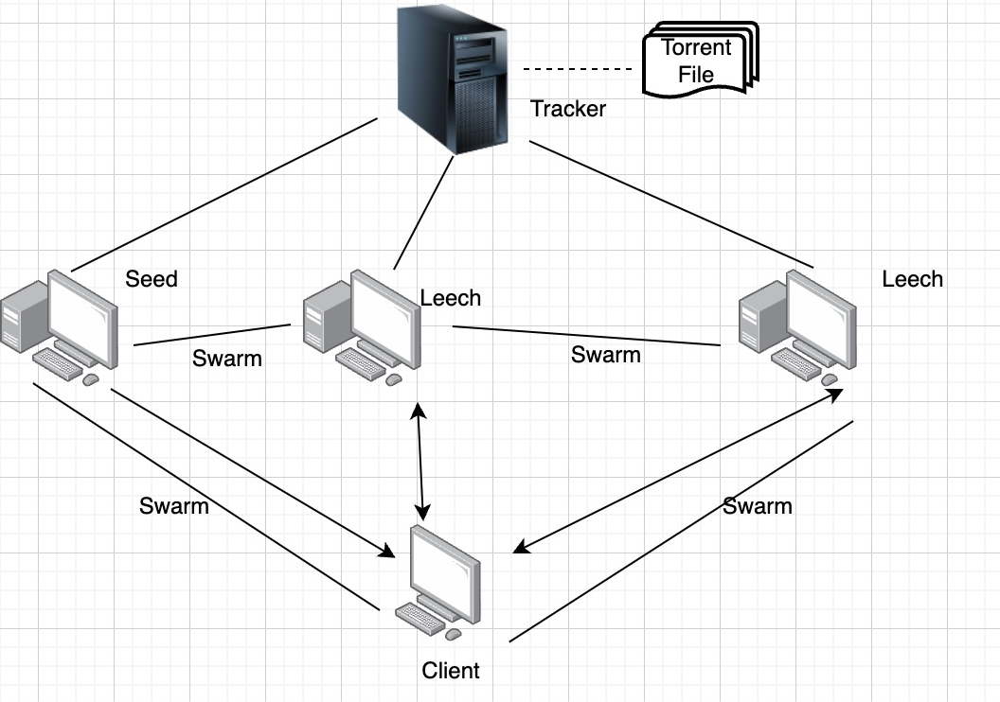

# BitTorrent Protocol Implementation

## Project Overview


This project implements a **distributed** peer-to-peer file sharing system based on the BitTorrent Protocol using MPI (Message Passing Interface). The implementation leverages both **distributed** computing principles for file sharing across network nodes and **parallelized** execution for efficient file transfer operations.

In this system, clients can act as seeds (initially possessing complete files) or peers (acquiring files during execution). To prevent overloading the tracker, it only stores file hashes rather than actual content. When a client wants to download a file, it queries the tracker, which provides the hashes and a list of clients that have the file, either partially or completely. The client then successively queries these other owners about the availability of specific hashes and, if available, the corresponding file segments are transmitted.

The **distributed** nature of the protocol is evident in how file distribution workload is shared among all participants, while **parallelized** download and upload operations allow each client to handle multiple file transfers simultaneously using separate threads.

## Architecture Diagram


*Diagram showing the BitTorrent protocol components: Tracker, Seeds, Leeches, and Swarm communication*


## Project Structure

The implementation is based on the following components:

### Client

Each client has a global structure that keeps track of:
- `hashes`: Hashes of each file it reads
- `own_files`: Files that it has read and sends to the tracker to identify which clients are seeds
- `desire_files`: Files it wants to download
- `desired_hashes`: Hashes of files it wants to download

### Tracker

The tracker has a structure that keeps track of:
- `owners_files`: Clients (seeds + peers) that own files
- `all_hashes`: Hashes of all files

## Implementation Details

### Helper Functions
- `send_message`: Sends a message (string)
- `receive_message`: Receives a message (string)

### Client Operations
1. The client reads its files
2. It sends the read data to the tracker
3. It waits for confirmation from the tracker that it can start downloading the desired files (after all clients have finished reading their files)

### Download Thread Function
1. Iterates through the list of files to be downloaded
2. The client sends a message to the tracker that it wants to start downloading a file, then sends the filename
3. It receives from the tracker the hashes that need to be downloaded from clients
4. Once every 10 segments received, the client asks the tracker for an updated list of clients that have the respective file
5. After 10 segments are received, the client sends a message to the tracker to update the list of clients that have the file (to include itself)
6. The client sends to one of the clients that have the file (completely or partially) the hash to check if they have it
   - If accepted (the respective client has the hash), it adds the received segment to the `desired_hashes` vector
   - If it doesn't exist, it queries the next client that has the file
7. At the end, the client prints the downloaded file

**Optimization**: Clients are chosen in turns to avoid blocking a single client for a long time (one segment is downloaded at a time, after which the client changes for another download)

### Upload Thread Function
1. The client continuously receives messages from clients/Tracker
2. If it receives the "CLOSE_THREAD" message, the thread is closed (all clients have finished downloading files)
3. First, the client receives the file
4. Second, the client receives the hash
5. It checks two lists to see if the hash exists:
   - `hashes` (unordered_map): Contains hashes downloaded from the beginning
   - `desired_hashes` (unordered_map): Contains hashes downloaded during program execution
   - If the hash doesn't exist, the client sends back a "DOESN'T_EXIST" message

### Tracker Operations
1. Receives the read files from all clients
2. Sends an "ACK" message to all clients that they can start the download process (all clients have finished reading)
3. The tracker continuously waits for messages from clients (MPI_ANY_SOURCE) until it receives a message from all clients that they have finished downloading the files

### Message Types
- `START_DOWNLOAD`: A client starts downloading a new file, so the tracker provides the hashes for that file
- `SEED_LIST`: The tracker sends the client a list of clients that have the file, either partially or completely (seed + peers)
- `UPDATE`: The tracker updates the list of clients that have a specific file
- `FINISH`: A client has finished downloading all files (the download thread has been closed and only the upload thread remains open)

## Building and Running

To build the project, use the provided Makefile:

```
make
```

To run the project:

```
make run
```

To clean the build files:

```
make clean
```

## Dependencies

- MPI (Message Passing Interface) for communication between clients and the tracker
- C++ Standard Library
- pthread for thread management

## Race Condition Prevention

A mutex is used in the download and upload thread functions to prevent race conditions when accessing or modifying the `desired_hashes` data structure.

## Author

Dragan Dragos Ovidiu, 333CAb, 2024-2025